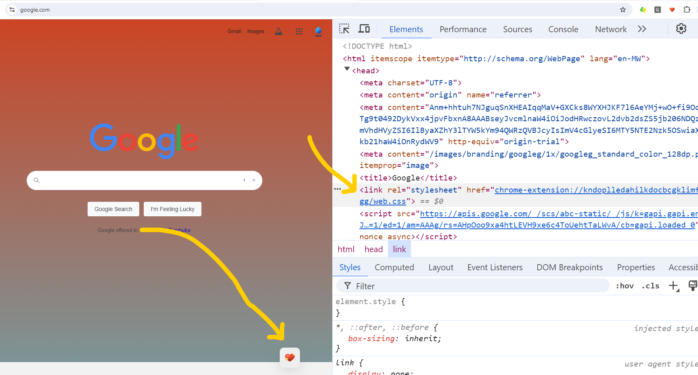

# mystyle
MyStyle extension will Insert a custom button on any webpage at the bottom right corner. When the button is clicked it will include our css file to the website, hopefully changing its style

